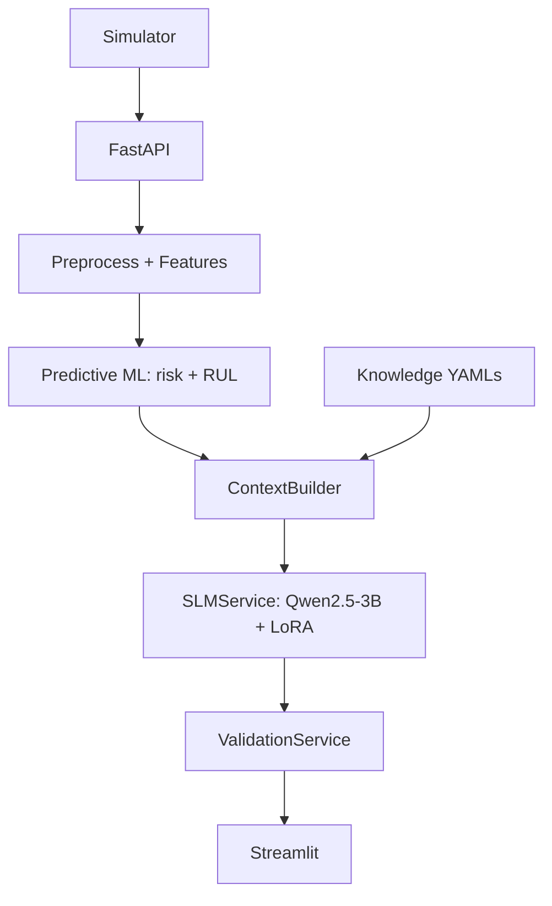

# Architecture (skeleton — filled per phase)

```mermaid
flowchart TD
    SIM[Simulator] --> API[FastAPI]
    API --> PRE[Preprocess + Features]
    PRE --> ML[Predictive ML: risk + RUL]
    ML --> CTX[ContextBuilder]
    KNOW[Knowledge YAMLs] --> CTX
    CTX --> SLM[SLMService: Qwen2.5-3B + LoRA]
    SLM --> VAL[ValidationService]
    VAL --> UI[Streamlit]
```
